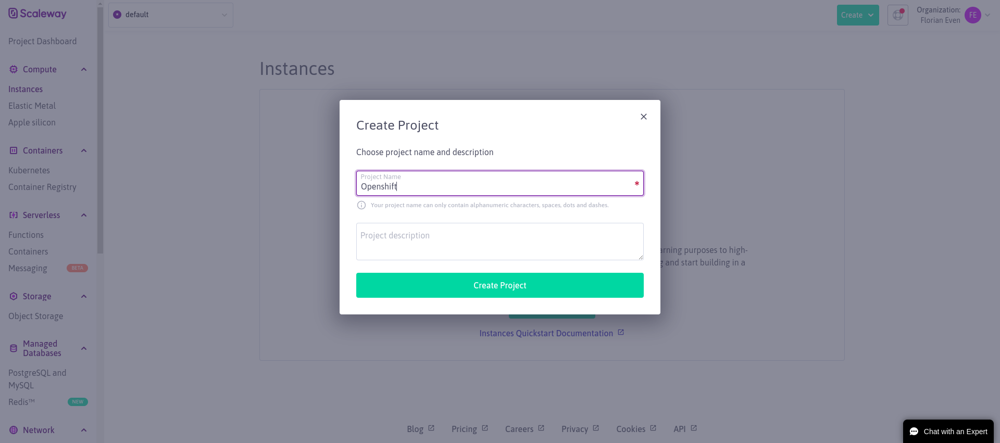
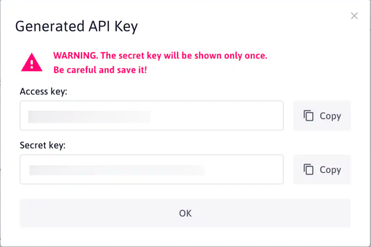

# Openshift on Scaleway

This repository describe a procedure to install Openshift on Scaleway using terraform and ansible

## Prerequisites

Create account on:
- Scaleway
- Domain name Manager (On that tutorial I use gandi)

Install ansible :

```shell
pip3 install ansible
```

Install terraform:

```shell
sudo yum install -y yum-utils
sudo yum-config-manager --add-repo https://rpm.releases.hashicorp.com/RHEL/hashicorp.repo
sudo yum -y install terraform
```

Create an ssh-key

```shell
ssh-keygen -f ~/.ssh/scaleway -t ed25519
```


## Scaleway configuration

After you have create you scaleay account, Go in the console (https://console.scaleway.com/) and on the top left clik on Create Project and write Openshift. Then click on create.



Then you need to create an api key. Click Identity and Access Management (IAM) from the top-right of your Organization Dashboard in the Scaleway console. You are taken to your Identity and Access Management dashboard. Click the API Keys tab.Click the «Plus Icon» button to generate a new API key. The following screen pops up:



NOTE: You need to keep the key and secret for the following part.

Then Get your organization ID using the following command:

```shell
curl -H "X-Auth-Token: <Your secret key>" https://account.scaleway.com/organizations | jq '.organizations[0].id'
```

Get your redhat pull secret at that URL https://console.redhat.com/openshift/install/pull-secret and put it on ~/.pull-secret.

## Create the Infrastructure

```shell
terraform apply -var pull_secret=~/.pull-secret -var scaleway_access_key=<Your access KEY> scaleway_secret_key=<Your secret key> -var scaleway_organization_id=<Your organization ID>  -var scaleway_project=openshift -var ssh_key=~/.ssh/scaleway
```

## Create DNS Records

After the creation of the infrastrcture your need to add record for the loadbalancer.

You need to edit record dns according to your base domain 

| Field Name | Loadbalancer |
|-----------------------------|-------------------|
|api.<cluster_name>.<base_domain> | api_openshift_lb|
|api-int.<cluster_name>.<base_domain> | api_openshift_lb|
|*.apps.<cluster_name>.<base_domain> | apps_openshift_lb|


Clean all

terraform destroy -var pull_secret=/home/feven/.pull-secret -var scaleway_access_key=SCW3T2MNVXH1ZS35FZEK -var scaleway_organization_id=210d20c5-33f5-4b5f-9f58-4be397df3160 -var scaleway_secret_key=6613d860-1204-4c94-bdb6-339e489aba37 -var scaleway_project=openshift -var ssh_key=/home/feven/.ssh/scaleway


